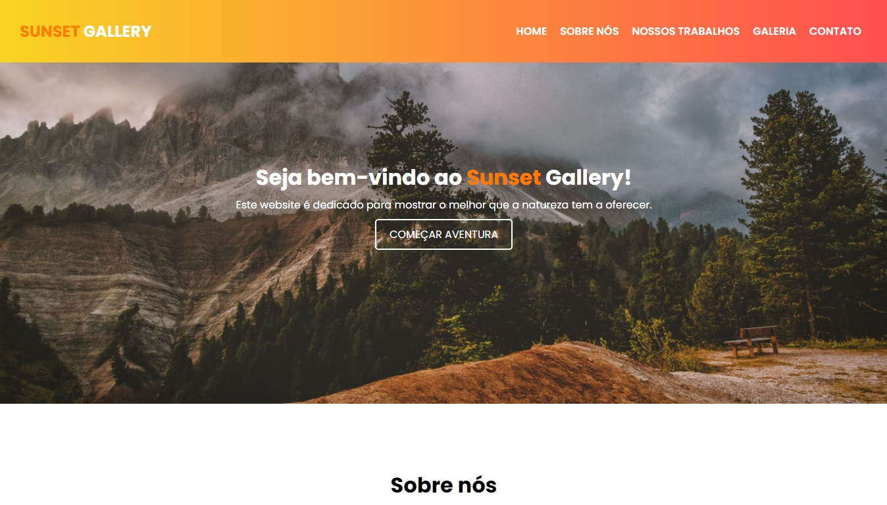

<h1 align="center"> :computer: Websites :computer: </h1>

<p align="center">

</p>

<p align="center">Olá! Seja bem-vindo ao meu repositório de websites. Aqui você irá encontrar todos os webistes que vou desenvolvendo ao decorrer do tempo.</p>
<p align="center">Este repositório será atualizado conforme novos projetos vão sendo desenvolvidos.</p>

<h2 align="center"> :computer: Tecnologias Utilizadas :computer:</h2>

<p align="center">
  
  
  
</p>

<h2 align="center">:rocket: Projetos Desenvolvidos :rocket:</h2>

<details>
  <summary>Hello Spring</summary>
  <p>Este é um website com uma temática sobre a primavera.</p>
  <p align="center"></p>
  <p align="center"><a href="https://github.com/matheusz98/websites/tree/master/Projeto%20Hello%20Spring">Link do projeto</a></p>
</details>

<details>
  <summary>MyScreenshots</summary>
  <p>Projeto de um website no qual eu disponibilizo uma pequena galeria dos meus screenshots capturadas em minhas jogatinas no Playstation 4.</p>
  <p align="center"></p>
  <p align="center"><a href="https://github.com/matheusz98/websites/tree/master/Projeto%20MyScreenshots">Link do projeto</a></p>
</details>

<details>
  <summary>CreativeFolio</summary>
  <p>Um pequeno portifólio para testar meus conhecimentos sobre HTML, CSS & JavaScript.</p>
  <p align="center"></p>
  <p align="center"><a href="https://github.com/matheusz98/websites/tree/master/Projeto%20CreativeFolio">Link do projeto</a></p>
</details>

<details>
  <summary>Fast Shopping</summary>
  <p>Um website e-commerce.</p>
  <p align="center"></p>
  <p align="center"><a href="https://github.com/matheusz98/websites/tree/master/Projeto%20Fast%20Shopping">Link do projeto</a></p>
</details>

<details>
  <summary>Sunset Gallery</summary>
  <p>Esta é uma atividade avaliativa do curso técnico na qual foi solicitado criar um website para colocar todo conhecimento em prática. Isso inclui galerias, vídeos, áudio, responsividade e etc.</p>
  <p align="center"></p>
  <p align="center"><a href="https://github.com/matheusz98/websites/tree/master/Projeto%20Sunset%20Gallery">Link do projeto</a></p>
</details>

<details>
  <summary>Coloris</summary>
  <p>Este é um website com o tema sobre paleta de cores.</p>
  <p align="center"></p>
  <p align="center"><a href="https://github.com/matheusz98/websites/tree/master/Projeto%20Coloris">Link do projeto</a></p>
</details>

<details>
  <summary>Web Modeling</summary>
  <p>Projeto de um website de agência de modelos, tentando criar uma boa variedade e cores e conteúdo.</p>
  <p align="center"></p>
  <p align="center"><a href="https://github.com/matheusz98/websites/tree/master/Projeto%20Web%20Modeling">Link do projeto</a></p>
</details>

<details>
  <summary>Meu Portfólio</summary>
  <p>Esta é a primeira versão do meu portfólio. Nele você irá encontrar meus projetos e um pouco sobre mim.</p>
  <p align="center"></p>
  <p align="center"><a href="https://github.com/matheusz98/websites/tree/master/Projeto%20Portfolio">Link do projeto</a></p>
</details>

<h4 align="center"> :construction: Este repositório está em construção, com o tempo ele será atualizado com novos projetos. :construction:</h4>

<h2 align="center">Curtiu o repositório? Fique a vontade para fazer uso dele! :grin:</h2>

```bash
# Clonar o repositório
$ git clone https://github.com/matheusz98/websites

# Ou
# Ir no code (botãozinho verde) e fazer download do zip.
```

<h2 align="center">Muito obrigado pela visita! :smile: :grinning: </h2>

